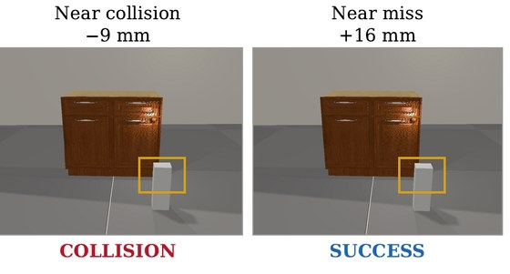

## Current Research

  
  

    
<strong>ArtiCollision: Can Multimodal LLMs Predict the Consequences of Articulated Motion?</strong>

    
Sohini Dutta, Prathosh A. P. · Ongoing research

    
Can multimodal LLMs predict whether an articulated object will collide with its surroundings from a single image and an action? I study this using controlled simulated scenes that separate sensitivity to collision geometry from simpler visual cues.

    
<em>My role:</em> I initiated and lead the project, built the simulation pipeline, and run the training and diagnostic experiments.

    
<a href="https://drive.google.com/file/d/1os2fuhWqmc05iWVTzoiSSeA96v0qo9xY/view?usp=sharing">Manuscript (PDF)</a>

  

  
  

    
<strong>SPiXSeg: Rethinking MLLM Segmentation as Superpixel Classification</strong>

    
Piyush Tiwary, Sohini Dutta, Prathosh A. P. · Preprint

    
SPiXSeg recasts segmentation with multimodal LLMs as superpixel classification. Each image is split once, without the query, into non-overlapping superpixels, and this one set of regions serves every task: referring segmentation keeps a subset, and semantic segmentation gives each superpixel a class. S2M scores each superpixel from the model's own hidden states, and the mask is the union of the chosen superpixels.

    
<em>My role:</em> I designed and built S2M, the superpixel tokens and the pluggable superpixel segmenters, and built the training and evaluation pipeline.

    
<a href="https://arxiv.org/abs/2611.33842">arXiv</a>

  

## Previous Research

  
  

    
<strong>Monocular Path Perception for Autonomous Navigation</strong>

    
Undergraduate research · IIT Madras · Dr. P. V. Manivannan · 2022

    
Detected the drivable floor from a single RGB image using monocular depth, superpixels and region merging, for robots without a depth sensor.

    
<a href="https://github.com/sohinidutta11/ground-plane-estimation">Code</a>

  

